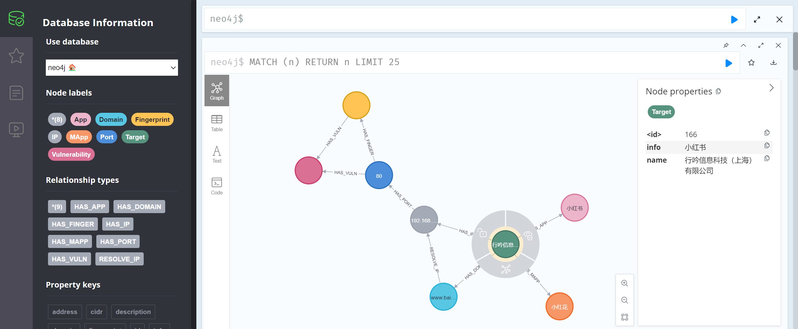

# go-assets

用neo4j存储资产信息




```go
package main

import "github.com/1nhann/go-assets/assets"

func main() {
	// 连接到 Neo4j 数据库
	uri := "bolt://127.0.0.1:7687"
	username := "neo4j"
	password := "neo4j"

	assetManager, _ := assets.NewAssetManager(uri, username, password)
	defer assetManager.Close()
	//assetManager.ClearDatabase()

	company := assets.Target{Name: "行吟信息科技（上海）有限公司", Info: "小红书"}
	ip := assets.IP{IP: "192.168.1.1", Cidr: "192.168.0.1/24"}
	port := assets.Port{Port: 80, IP: "192.168.1.1"}
	fingerprint := assets.Fingerprint{Name: "SSH-1.99"}
	vulnerability := assets.Vulnerability{ID: "CVE-2021-12345"}
	domain := assets.Domain{Domain: "www.baidu.com"}
	app := assets.App{Name: "小红书"}
	mapp := assets.MApp{Name: "小红花"}

	assetManager.AddNode(mapp)
	assetManager.AddNode(app)
	assetManager.AddNode(company)
	assetManager.AddNode(ip)
	assetManager.AddNode(port)
	assetManager.AddNode(fingerprint)
	assetManager.AddNode(vulnerability)
	assetManager.AddNode(domain)
	assetManager.AddRelation(company, ip)
	assetManager.AddRelation(company, domain)
	assetManager.AddRelation(domain, ip)
	assetManager.AddRelation(ip, port)
	assetManager.AddRelation(port, fingerprint)
	assetManager.AddRelation(fingerprint, vulnerability)
	assetManager.AddRelation(port, vulnerability)
	assetManager.AddRelation(mapp, company)
	assetManager.AddRelation(mapp, company)
	assetManager.AddRelation(app, company)
}

```

